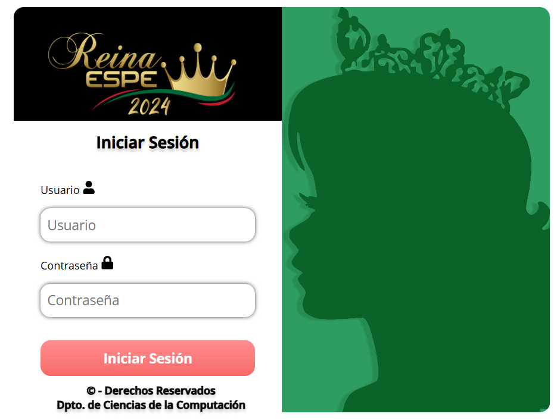
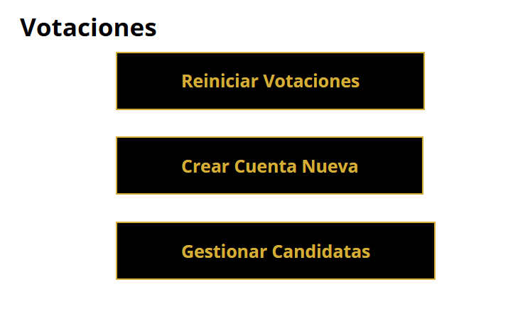
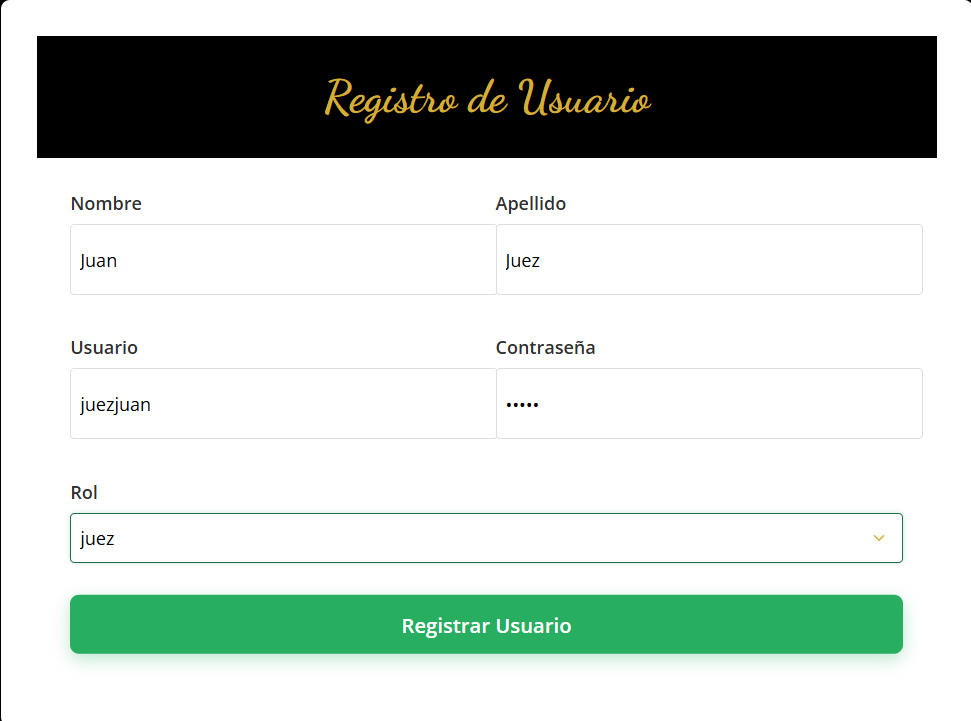
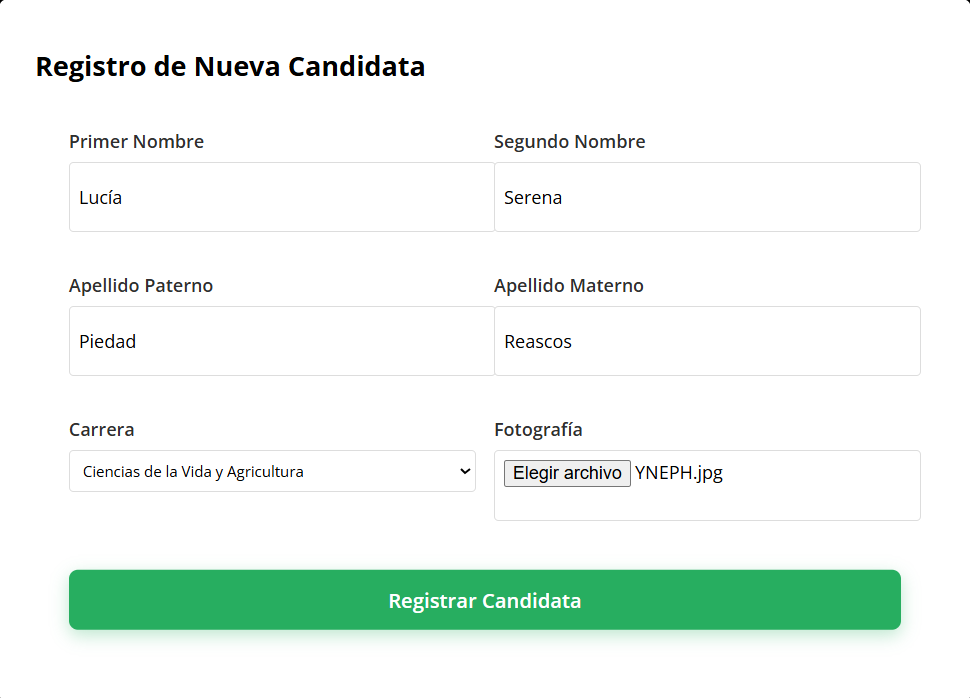
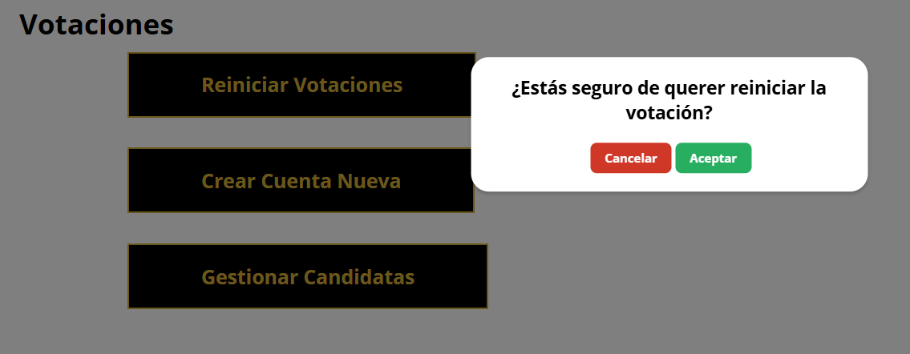

# Sistema de Elección de Reinas - v3.0.0


## Índice de Contenidos
1. [Introducción](#introducción)
2. [A quién va dirigido este manual](#a-quién-va-dirigido-este-manual)
3. [Requisitos Previos](#requisitos-previos)
4. [Instalación](#instalación)
5. [Preparar una Votación](#preparar-una-votación)

## Introducción
El sistema de elección de reinas es una aplicación web diseñada para facilitar la elección de una reina universitaria.

Este sistema permite a los administradores crear cuentas para jueces, candidatas y notarios, gestionar votaciones y generar informes de resultados.

## A quién va dirigido este manual
Este manual está diseñado para guiar al <b>administrador del sistema</b> en la instalación y configuración del sistema de elección de reinas.

A continuación, se detallan los pasos necesarios para llevar a cabo la instalación y configuración del sistema.
## Requisitos Previos
1.  Tener instalado Node.js y npm en tu máquina. Puede verificarlo ejecutando los siguientes comandos en la terminal:
```bash
node -v
npm -v
```
2. Asegúrese de tener instalado MySQL en su máquina. Puede verificarlo ejecutando el siguiente comando en la terminal:
```bash
mysql -V
```
3. MySQL debe tener la configuración del tipo 'legacy' para evitar problemas de compatibilidad con la versión de Node.js utilizada. <br><br>Esto significa que la contraseña por defecto debe de ser 'password'.<br><br> Para cambiar la contraseña de MySQL, puede usar el siguiente comando en la terminal:
````sql
ALTER USER 'root'@'localhost' IDENTIFIED WITH mysql_native_password BY 'password';
````
## Instalación
1. Verifique que tiene Git instalado. Puede verificarlo ejecutando el siguiente comando en la terminal:
```bash
git --version
```
2. Clonar el repositorio del proyecto desde GitHub. Puede hacerlo ejecutando el siguiente comando en la terminal:
```bash
git clone https://github.com/dylanhdz/ProyectoReinasv2.0
```
En su defecto, puede usar GitHub Desktop para clonar el repositorio. 
<br><br>Para ello, siga estos pasos:
- Abra GitHub Desktop y haga clic en "Clone a repository from the Internet...".
- En la ventana emergente, pegue la URL del repositorio en el campo "Repository URL".
- Seleccione la ubicación en su máquina donde desea clonar el repositorio y haga clic en "Clone".
- Espere a que se complete la clonación del repositorio.

3. Navegar al directorio del proyecto clonado:
```bash
cd ProyectoReinasv2.0
```
4. Instalar las dependencias necesarias para el proyecto. Puede hacerlo ejecutando el siguiente comando en la terminal:
```bash
cd client
npm install
cd ../api
npm install
```
5. Ejecutar el script de inicialización de la base de datos. Puede hacerlo ejecutando el siguiente comando en la terminal:
```bash
cd ..
mysql -u root -p password < Mayo2025.sql
```
6. Cambiar la ip en el archivo /src/pages/ip.js por la ip de su red local. Reemplace 'localhost' por la dirección IP de su máquina en la red local. Puede encontrar su dirección IP ejecutando el siguiente comando en la terminal:
```bash
ipconfig (Windows)
ifconfig (Linux/Mac)
```
## Preparar una Votación
1. Inicie el servidor de la API ejecutando el siguiente comando en la terminal:
```bash
cd api
npm start
```
2. Inicie el servidor del cliente ejecutando el siguiente comando en la terminal:
```bash
cd client
npm start
```
3. Abra su navegador web y navegue a la dirección IP de su máquina en la red local, seguido del puerto 3000. Por ejemplo:
```bash
http://10.0.0.1:3000
```
4. Inicie sesión como administrador utilizando las credenciales proporcionadas:
```bash
Usuario: admin
Contraseña: admin
```

5. Una vez que haya iniciado sesión, haga clic en el botón "Crear Cuenta Nueva" para crear las cuentas de los jueces que participarán en la votación.

6. Complete el formulario con la información del juez y haga clic en "Crear Cuenta".

7. Repita el paso 5 y 6 para cada juez que desee agregar a la votación. Recuerde apuntar las credenciales de cada juez, ya que las necesitará para iniciar sesión en el sistema.
8. Una vez que haya creado todas las cuentas de los jueces, haga clic en el botón "Gestionar Candidatas" para crear nuevas candidatas para el evento.

9. Una vez que haya creado todas las cuentas de las candidatas, haga clic en el botón "Reiniciar Votaciones" para preparar al sistema.

10. Está listo para iniciar la votación.
